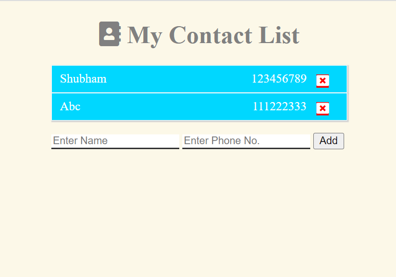

# Contact List
  
  
  It is the extension of the previous app made using Express. Database is attached with it so that on refresing data does not remove.

  ## Technology:
  - Node.js and Express
  - MongoDb as Database
  - EJS as Template Engine

  ### Working
  - First as the main page is loaded it serches for all the contact in the database and render it to home page. Where all the contacts are shown.
  - In the home page there is a form for adding the contact. On clicking the add button the controller goes to /create-contact and creates the contact in the database and then it return back to home page where new contact is shown.
  - Then there is a delete button with contacts to delete them. On clicking them It goes to /delete-contact and find the element in the database with the use of id, which is passed as query parameters, and deletes it.
